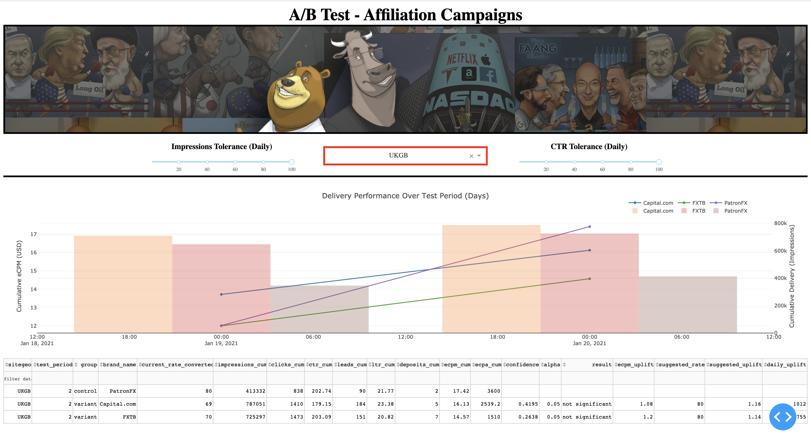
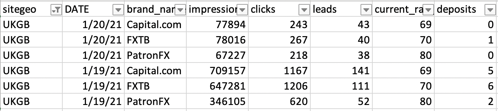
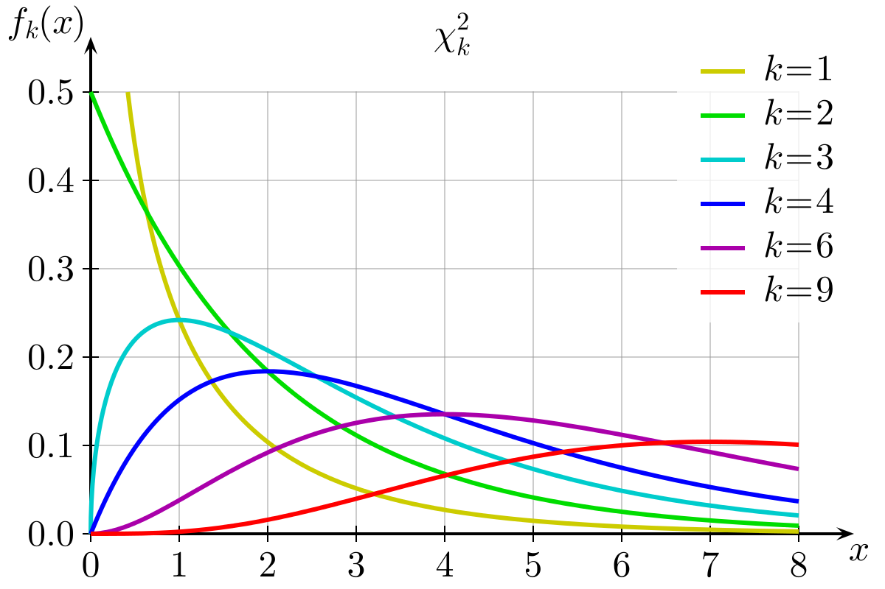

# Affiliate Performance Application


## Basic Overview


## Table of Contents

1. [Project Objectives](#Project-Objectives)
2. [Resources / Tools](#Resources-/-Tools)
3. [Data Collection](#Data-Collection)
4. [Statistical Test](#Statistical-Test)
5. [Dash Deployment](#Dash-Deployment)

## 1. Project Objectives

* Collect affiliate data in a relevant time period.
* Compare performances based on sound statistical tests.
* Display results in an easy-to-read application.
* Suggest rate adjustments to maximize revenues.

## 2. Resources / Tools

* Google BigQuery (SQL)
* Python
* Pandas
* Plotly
* Dash
* Docker

## 3. Data Collection

* [SQL Query](https://github.com/quentinb28/affiliate-performance-app/blob/main/src/query_sql.py)
* [Get Data](https://github.com/quentinb28/affiliate-performance-app/blob/main/src/get_data.py)

## 4. Statistical Test

## 5. Dash Deployment

This directory was created to measure brokers' performances in all SiteGeo combinations.



## What is the rationale behind this dashboard?

1 - Build Current Rates Converted Table (BigQuery)
``` SQL
select 
  ad.Account_Name, 
  ad.Brand, 
  ad.country_code, 
  case when ad.Opportunity_Currency like 'USD' then max(ad.Net_Sales_Price) else max(ad.Net_Sales_Price) * er.exchange_rate end current_rate_adjusted 
from 
  `DATA_LAKE_MODELING_US.sf_active_deals` ad 
  left join (
    select 
      * 
    from 
      `DATA_LAKE_MODELING_US.exchange_rates` 
    where 
      yearmonth = (
        select 
          max(distinct yearmonth) 
        from 
          `DATA_LAKE_MODELING_US.exchange_rates`
      )
  ) er on ad.Opportunity_Currency = er.currency2convert2dollars 
where 
  cast(ad.Item_Start_Date as date) <= current_date() 
  and cast(ad.Item_End_Date as date) >= current_date() 
  and ad.Product like 'TNB' 
  and ad.Model not like 'CPA' 
  and ad.Affiliate_ID not in (
    '110434', '109327', '109328', '109329', 
    '120823'
  ) 
group by 
  ad.Account_Name, 
  ad.Brand, 
  ad.country_code, 
  ad.Opportunity_Currency, 
  er.exchange_rate
```
2 - Build Master Postback Current Rate Converted Table (BigQuery)

3 - Build query of comparable data (../src/query_sql.py)



4 - Create filters to eliminate unbalanced data based on Impressions & CTR (Daily)

5 - Identify control per SiteGeo: best cumulated eCPM over test period (Leads * Current Rate Converted * 1000 / Impressions)

6 - Run Chi Square test for each variant against control with alpha = .05

* H0: Leads/Impressions is independent upon Brand (pvalue > alpha)

* H1: Leads/Impressions is dependent upon Brand (pvalue < alpha)



7 - Recommendations:

* Result = Significant => Multiply Current Converted Rate by eCPM uplift

* Result = Not Significant:

   * Control Rate Converted > Variant Rate Converted => Control Rate Converted
   
   * Control Rate Converted < Variant Rate Converted => No change

## Installing / Getting started

The minimal requirements are pip and Python v 3.7.

## Developing / Publishing

Here's a brief intro about what you must do in order to start developing
the project further:

```shell
git clone https://github.com/quentinb28/investingcom.git
cd investingcom/create_unf_imps_report
git checkout your_branch
BRING YOUR AMAZING IDEAS!
git add your_changes
git commit -m 'added your_changes'
git push
```

## Features
- get unfilled impressions report from Google Ad Manager (GAM)
- compute Site Geo eCPMs over the last 30 days
- compute potential revenue loss (unfilled impressions * eCPMs)
- save to Google Big Query as unfilled_imps_report_yesterday

## Contributing

If you'd like to contribute, please fork the repository and use a feature
branch. Pull requests are warmly welcome.

Please keep in mind that some of these projects might not be relevant anymore,
as our processes constantly evolve.

## Licensing

Copyright © Investing.com . All rights reserved.
